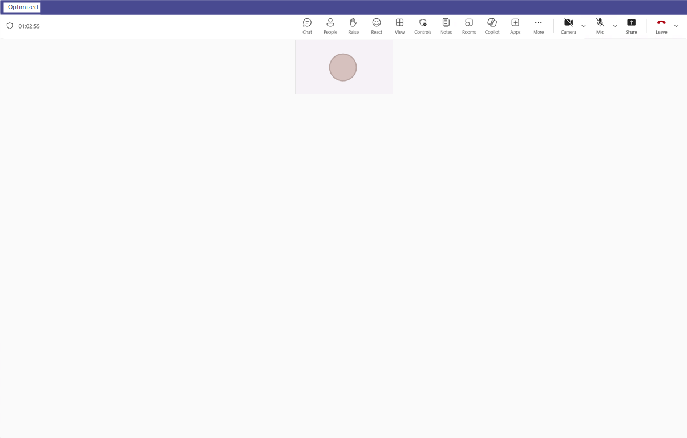
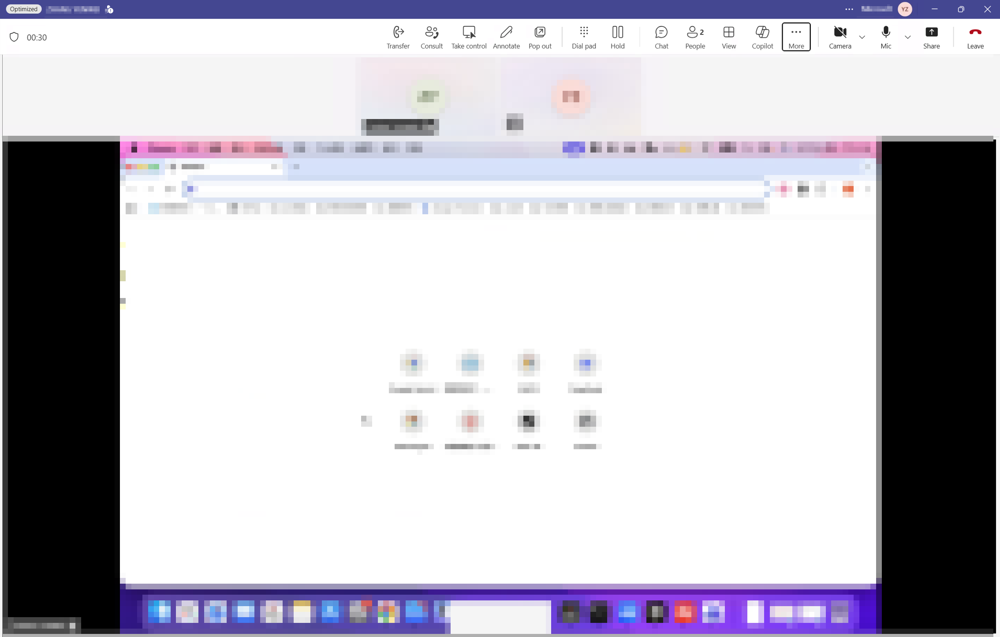

# FloatShot

FloatShot fixes one annoying screenshot problem:

> You are using **Windows App** to connect to a **Dev Box / Cloud PC / Azure Virtual Desktop**, and you join a **Microsoft Teams meeting inside the remote desktop**. When you take a screenshot inside the remote session, Teams meeting content may come out blank, black, or white.

FloatShot runs on your **local Windows PC**, floats above the full-screen Windows App session, and captures what is actually shown on your local screen.

This is useful because optimized Teams VDI media can be rendered on the local endpoint instead of fully inside the remote VM. Microsoft documents this limitation in [New VDI solution for Teams](https://learn.microsoft.com/en-us/microsoftteams/vdi-2#known-issues): screenshots of Teams content such as incoming screen sharing or video feeds might capture a black square because the content is offloaded to the user's device.

## Example

In an optimized Teams VDI session, an in-session screenshot can show the meeting content as blank or black even though the meeting is visible on your local screen.



FloatShot runs on the local endpoint instead, so it can capture the locally rendered remote meeting view while the remote desktop session is full screen.



## Why Use It

- Teams runs inside your Dev Box, but normal screenshots from the Dev Box show blank/black/white meeting content.
- You need a small screenshot button that still appears while Windows App is full screen.
- You want a quick PixPin-like flow: select, mark, pin, copy, or save.

## Features

- Shows a draggable floating screenshot button on the local desktop.
- Stays visible over Windows App / Dev Box full-screen sessions by using a layered topmost tool window.
- Captures a selected region, all monitors, the primary screen, or the active window.
- Lets you adjust the selected region before confirming.
- Provides region toolbar actions for rectangle mark, pen mark, pin, copy, save, and cancel.
- Supports pinned screenshots that can be moved, zoomed, copied, saved, or closed.
- Saves screenshots to a configurable folder and can optionally copy captures to the clipboard.

## Best For

- Windows App + Dev Box / Cloud PC / Azure Virtual Desktop.
- Teams meetings running inside the remote session.
- Full-screen remote work where local screenshot controls are hard to reach.
- Quick annotation and pinned reference screenshots.

FloatShot is intentionally small. It is not trying to replace full annotation suites; it focuses on the common PixPin-like flow of select, mark, pin, copy, or save.

## What FloatShot Is Not

- It is not a Teams VDI optimizer, Teams plugin, or remote desktop component.
- It does not change Teams, Windows App, Dev Box, Azure Virtual Desktop, or screen sharing behavior.
- It does not bypass enterprise security controls. If your organization enables policies such as [AVD Screen Capture Protection](https://learn.microsoft.com/en-us/azure/virtual-desktop/screen-capture-protection), those policies may still block client-side capture.
- It does not guarantee capture of protected content such as DRM video, secure windows, or content blocked by endpoint security software.

## Related Microsoft Documentation

- [New VDI solution for Teams](https://learn.microsoft.com/en-us/microsoftteams/vdi-2) explains the Teams VDI architecture and the known screenshot limitation for offloaded Teams content.
- [Use Microsoft Teams on Azure Virtual Desktop](https://learn.microsoft.com/en-us/azure/virtual-desktop/teams-on-avd) describes Teams media optimization with Windows App / Remote Desktop clients and how to verify whether Teams is optimized.
- [AVD Screen Capture Protection](https://learn.microsoft.com/en-us/azure/virtual-desktop/screen-capture-protection) documents policy-based screen capture blocking for remote desktop clients.

## Requirements

- Windows 10 or later.
- x64 Windows for the packaged release build.
- No .NET runtime installation is required for the release artifact because the app is published self-contained.

## Build From Source

```powershell
cd src\FloatShot
dotnet publish -c Release -o ..\..\publish
```

The published executable will be written to `publish\FloatShot.exe`.

## Build Installer

Install [Inno Setup](https://jrsoftware.org/isinfo.php), then run:

```powershell
.\build\package-installer.ps1
```

The installer will be written to `installer\Output\FloatShotSetup-0.2.4.exe`.

## Troubleshooting

### Setup is stuck at `Closing applications...`

This was a known issue in the old `0.2.0` installer when FloatShot was already running.

Use the latest installer, or exit FloatShot from the tray menu before installing. Starting with `0.2.2`, the installer stops the running FloatShot process before copying files, so this screen should not hang.

## Usage

- Drag the floating button to place it where you want.
- Click the button for the default capture mode.
- Use Settings to change save folder, default mode, hotkeys, clipboard behavior, floating button visibility, and startup behavior.
- In region capture mode, drag to select an area, then resize or move the selection before choosing an action.
- Use the toolbar to mark, draw, pin, copy, save, or cancel.

## Testing

Before publishing a release, run through [docs/TESTING.md](docs/TESTING.md).

## License

MIT. See [LICENSE](LICENSE).